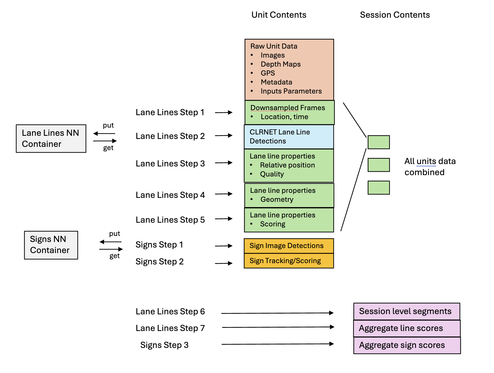
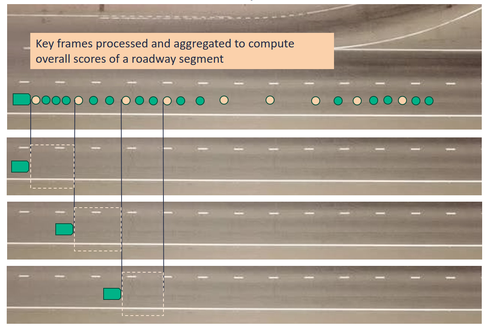
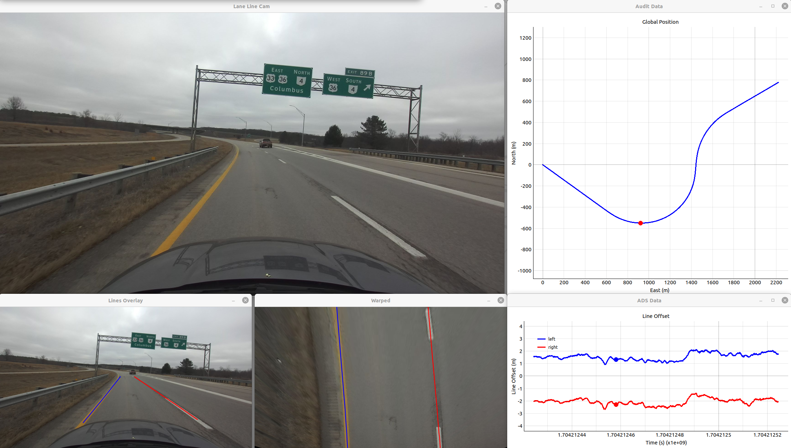
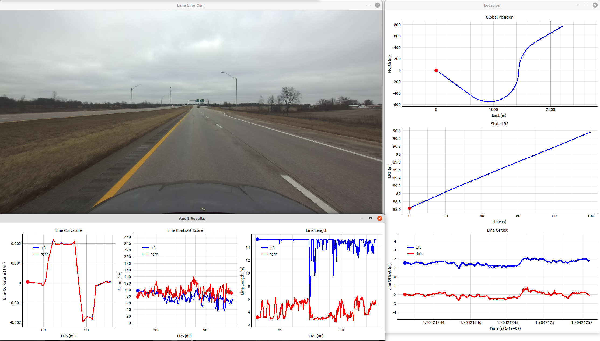
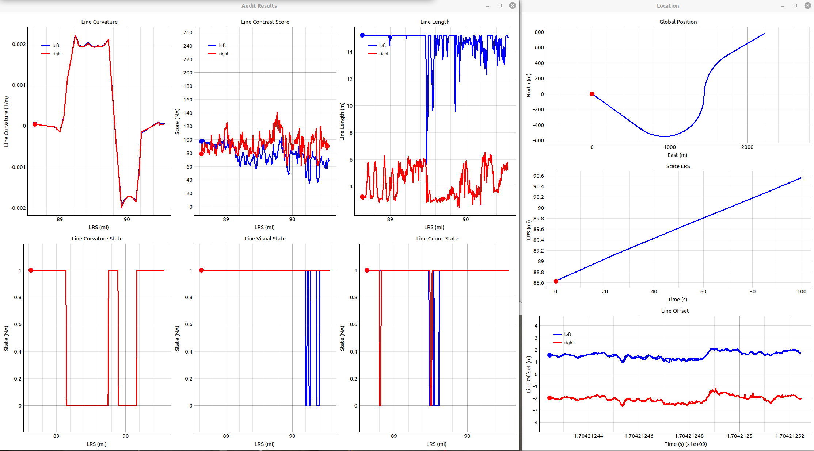
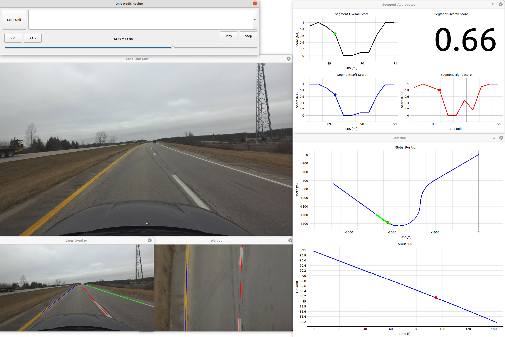
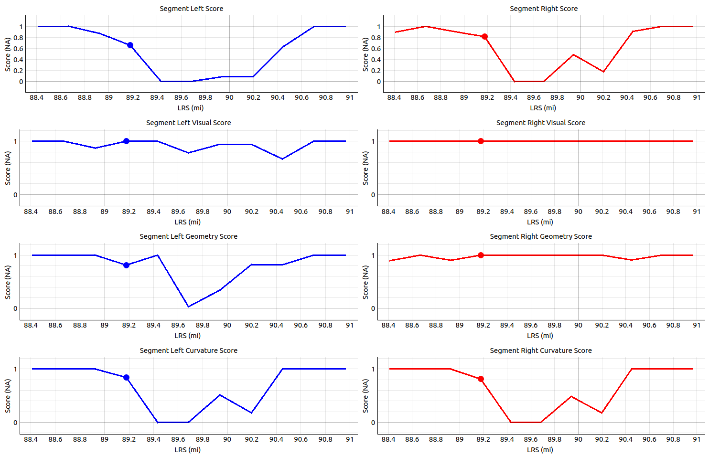
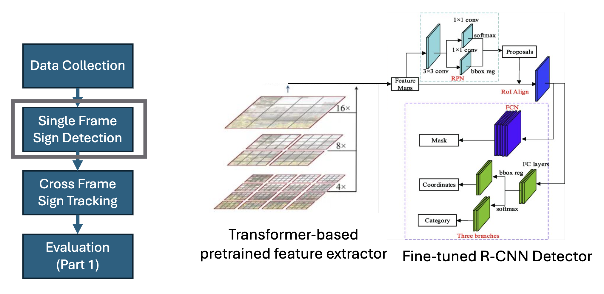
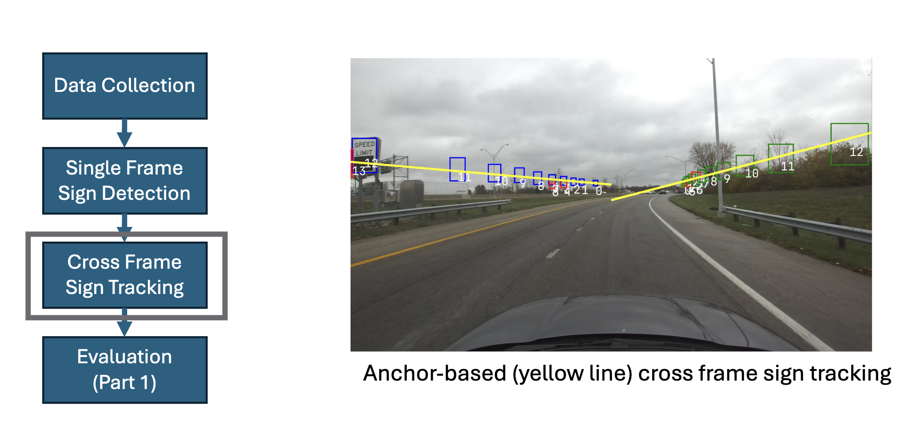
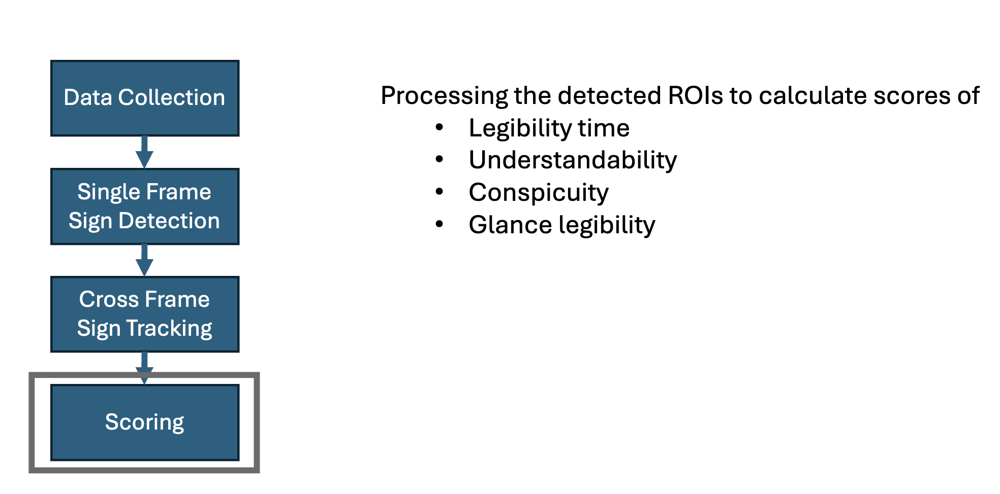

# Methods
Methodology and thoughts around the techniques and technologies used throughout the ARRAT system

# Overview
This repository contains methods for road audit data processing. Data processing is divided into several steps, from raw data ingestion to computed metrics. Data processing is divided into two broad categories, lane line evaluation and speed sign evaluation, each with its own set of algorithms and methods specifically designed for their respective application.  

## Processing Steps Outline

Figure below shows the block diagram of lane line processing steps.  




## Unit Data Structure

* Each road audit data "unit" contains raw user-generated data.
* All units comprising an audit are located in the same directory
* Each unit directory is numbered, e.g. unit1, unit2, and so on.
* The collection of units is called a session.

Each unit directory contains the following:

| Item | Description                                   |   Format   |
| :--: | :-------------------------------------------- | :--------: |
|  1   | Directory of raw camera image files | ```<timestamp>.png``` |
|  2   | Text file with location data from vehicle GPS | ```gps.txt``` |
|  3   | Optional directory of raw camera depth map files (used only in sign processing) | ```<timestamp>.bin``` |
|  4   | Input settings, parameters, and calibration data | ```inputs.json``` |
|  5   | Metadata | ```unit_metadata.json``` |


## Usage

### Overview
Lane line processing steps 1-5 and sign steps 1-2 process one unit at a time, thereofore they input unit data directory.

```
python step<>.py --datadir  /path/to/unit
```

Lane line step 2 and sign step 1 are the two steps that involve transfering data to Machine Learning based containers and getting the data back. The execution of the two containers is descirbed in separate repsitories. These steps require using **put** and **get** arguments for sending data to, and receiving from the containers.


```
python step<>.py --datadir  /path/to/unit --put 1 --get 0
```

```
python step<>.py --datadir  /path/to/unit --put 0 --get 1
```

Remaining steps process the data at session level, i.e., aggregate all units contained in the session to produce final summary of results.

```
python step<> --datadir  /path/to/session
```

### Sequence of Execution of Pipeline

Note that the order of executing these steps is important. They must be executed in the following order.

First run all the unit processing steps

1. Lane line steps 1 through 5
2. Sign steps 1 and 2

Then run session processing steps that aggregate unit results

3. Lane line step 6
4. Sign step 3


<br>

# Description of Pipeline Steps

## Step 1 - Downsample for Lane Line Processing

This is the first step in the pipeline that begins with processing standard raw unit data. This step downsamples the data to only the necessary key frames used for lane line processing. As discussed in **the Guidebook**, the camera selection was informed by depth of field of interest and resolution desired to be able to observe lane markings on either side of the driving lane. This consideration is important to optimally choose the lookahead distance for lane line assessment in each image. The lookahead distance chosen is short enough to not lose pixel density for farther away region but long enough that at highway speed, each frame has some overlap of lane markings with the previous frame, such that no portion of lane markings is skipped. 

### Key Frames



### Example Usage

**Arguments**

* Path to data directory (unit)

```
python step1_downsample_units.py --datadir  /path/to/unit
```

### Example Results from Step 1


#### Data Files

Lane line frame data output contained in ```frames.json``` has the following fields populated for each downsampled frame. Subsequent steps of the pipeline append more fields to each frame in `frames.json`.

```
{
    "laneline_frames": [
        {
            "time": "1704212844.965645313",
            "latitude": 40.25185225,
            "longitude": -83.38272445,
            "lrs": -1.0,
            "heading": -2.5866,
            "speed": 31.2501,
            "path_increment": 0.0,
            "time_increment": 0.0
        },
        {
            "time": "1704212845.360790491",
            "latitude": 40.2517968,
            "longitude": -83.3828482,
            "lrs": -1.0,
            "heading": -2.5856,
            "speed": 31.2775,
            "path_increment": 12.19676630925886,
            "time_increment": 0.3951451778411865
        },
```


***

<div style="page-break-after: always; break-after: page;"></div>

## Step 2 - Laneline Neural Network CLRNET

* Put Data to CLRNET
* Run CLRNET
* Get Results from CLRNET

#### 2.1 Put Data

```
python step2_run_clrnet.py --datadir  /path/to/unit --put 1 --get 0
```

#### 2.2 Run CLRNET

CLRNET is run in a docker container. Inside the container executing the command `make exec` runs the command:

`python main.py configs/clrnet/custom_cla_dlr34_culane.py` with additional arguments already configured. See `Install_NNs.md` for details. 

Assuming the container `clrnet_ra` is available.

```bash
docker start clrnet_ra
```

Then run
```bash
cd /path/to/NN_models/lane_detection
make exec
```

This will generate the CLRNET results, which then have to transfered to the main pipeline as shown next.


#### 2.3 Get Results

```
python step2_run_clrnet.py --datadir  /path/to/unit --put 0 --get 1
```


### Example Results from Step 2


#### Data Files

Lane line detected image coordinates are generated in the directory ```clrnet``` within the unit directory.


#### Review Panel




***

<div style="page-break-after: always; break-after: page;"></div>

## Step 3 - Compute Line Visual and Geometry Scores

```
python step3_ego_lanelines.py --datadir  /path/to/unit
```

* Compute line marking contrast
* Compute line marker length


***

<div style="page-break-after: always; break-after: page;"></div>

## Step 4 -  Compute Line Geometry Properties

```
python step4_ego_curvature.py --datadir  /path/to/unit
```

* Compute line curvature
* Perform curve fits and distinguish between coarse (smoothed) and fine (raw) curvature at each frame


#### Review Panel




***

<div style="page-break-after: always; break-after: page;"></div>

## Step 5 - Extract Lane Line Events

```
python step5_extract_events.py --datadir  /path/to/unit
```

* Extract lane line events from visual, geometry, and curvature metrics at each frame
* Score various properties at each frame


### Example Results after Step 5


#### Data Files

Lane line frame data output contained in ```frames.json``` adds more fields related to ego lane line detection.

```
"time": "1704212424.558373451",
"latitude": 40.24174264,
"longitude": -83.41530497,
"lrs": -1,
"heading": -0.612,
"speed": 33.0533,
"path_increment": 0.0,
"time_increment": 0.0,
"line_valid_left": true,
"line_valid_right": true,
"line_offset_left": 1.564108910891089,
"line_offset_right": -1.981497524752475,
"line_score_left": 97.13365539452496,
"line_score_right": 78.92748091603053,
"line_length_left": 15.24,
"line_length_right": 3.21487922705314,
"curvature_coarse_left": 4.5487900667880426e-05,
"curvature_fine_left": 3.915808206420238e-05,
"curvature_coarse_right": 4.198696181392925e-05,
"curvature_fine_right": 2.6142226994543447e-05,
"visual_state_left": 1,
"visual_state_right": 1,
"geom_state_left": 1,
"geom_state_right": 1,
"curv_state_left": 1,
"curv_state_right": 1,
"overall_state_left": 1,
"overall_state_right": 1
```





***

<div style="page-break-after: always; break-after: page;"></div>


## Step 6 - Aggregate Scores

This step combines data from all units in a session to generate lane line segment information. For this step the data directory argument is the session directory containing all units. 

Step 6 is the step where lane line frames are segmented using `segment_length` parameter in `inputs.json` for each unit. 

```
python step6_segmentation.py --datadir  /path/to/session
```

* Aggregate frame data to score segments
* Output segment data


#### Data Files

* Segment data is output in ```session.geojson``` `


**Overall View**



**Detailed View**



<div style="page-break-after: always; break-after: page;"></div>

# Road Audit Sign Pipeline 

Sign detection pipeline follows similar scheme as lane lines. First each unit data is sent to a docker container that runs neural network phase. Then further clustering, tracking and scoring of signs is done and added to session results.

## Step 1 - Sign Detection

### Workflow

* Put Data to Sign Detection Model
* Run Sign Detection Model
* Get Results from Sign Detection Model

**Arguments**

* Path to data directory (unit)
* Flag to put images into sign detection folder
* Flag to get sign detection results

#### 1.1 Put Data

```
python signs_step1_image_proc.py --datadir  /path/to/unit --put 1 --get 0
```

#### 1.2 Call Sign Detection model

Sign Detection is run in a docker container. See `Install_NNs.md` for details. 

Assuming the container `amsign_ra` is available.

```bash
docker start amsign_ra
```

Then run
```bash
cd /path/to/NN_models/sign_detection/code/docker
source source_env.sh
make exec
```

**Note**:
Inside the container executing the command `make exec` runs the script `am_sign_interface_ocr.py`

This will generate the sign detection results, which then have to transfered to the main pipeline as shown next.


#### 1.3 Get Results

```
python signs_step1_image_proc.py --datadir  /path/to/unit --put 0 --get 1
```

The results of all the frames in which speed limit signs are detected are generated in the directory `signs_ocr` within the unit directory.

to do sign detected image here

## Step 2 - Locate, Track, and Score the Detected Signs

Typically an instance of a sign is detected in multiple frames. This step tracks and combines multiple frames and outputs a list of unique signs with their location properties and quality scores. 

### Inputs

* GPS data
* Sign detection result
* Calibration data

### Example Usage

**Arguments**

* Path to data directory (unit)

```
python signs_step2_locator.py --datadir  /path/to/unit
```

The sign detection algorithm steps are as follows:

 
 


## Step 3 - Add Signs to Session Output with Lane Line Results

Similar to lane lines, this step for signs aggregates the sign detections and scores from all units into a final session level output ```session.geojson```.

### Example Usage

**Arguments**

* Path to all unit

```
python signs_step3_add_info.py --datadir  /path/to/session
```

Here is a list of various sign related fields added to the output.

```bash
"type": "Feature", 
"properties": { 
    "timestamp": "1749741780.191893101", 
    "id": "1", 
    "unit": "unit1", 
    "color": "red", 
    "lrs": -1, 
    "roi_x": 6.899257624144209, 
    "depth": 14.414019395312277, 
    "overall_score": 1.0, 
    "legibility_time": 2.6005430221557617, 
    "legibility_time_score": 1.0, 
    "conspicuity": 1.0, 
    "conspicuity_score": 1.0, 
    "glance_legibility": 1.0833333333333333, 
    "glance_legibility_score": 1.0, 
    "understandability": 0.9984862, 
    "understandability_score": 1.0, 
    "side": "right", 
    "info": "spee limit 76 " 
}, 

"geometry": { 
"type": "Point", 
"coordinates": [ 
    -83.5742654446189, 
    40.31496309250692 
    ] 
} 
```

The session results contained in `session.geojson` are now available to be visualized on the ARRAT dashboard.